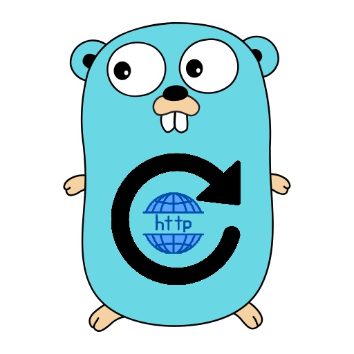

# go-retryable-httpclient



This is a tiny Go retryable http client to use when consuming Rest APIs.

It uses [go-retryablehttp](https://github.com/hashicorp/go-retryablehttp) underneath.

For more information see the
[godoc](https://pkg.go.dev/github.com/tiagomelo/go-retryable-httpclient).

## available options

- `WithHttpClient` adds a specified httpClient to be used
- `WithTimeout` adds a timeout to the client
- `WithMaxIdleConns` defines the maximum number of idle (keep-alive) connections across all hosts.
- `WithMaxIdleConnsPerHost` defines the maximum idle (keep-alive) connections to keep per-host.
- `WithMaxConnsPerHost` limits the total number of connections per host
- `WithMaxRetries` limits the maximum number of retries
- `WithRetryWaitMin` specifies minimum time to wait before retrying
- `WithRetryWaitMax` specifies maximum time to wait before retrying
- `WithCheckRetryPolicy` specifies the policy for handling retries, and is called after each request
- `WithRequestDumpLogger` specifies a function that receives the request dump for logging purposes
- `WithResponseDumpLogger` specifies a function that receives the response dump for logging purposes

## usage

```
const url = "http://someurl/"

client := httpclient.New(
    httpclient.WithTimeout(30 * time.Second),
    httpclient.WithMaxConnsPerHost(200),
    httpclient.WithMaxIdleConnsPerHost(200),
    httpclient.WithMaxIdleConns(200),
    httpclient.WithMaxRetries(5),
    httpclient.WithRetryWaitMin(1 * time.Second),
    httpclient.WithRetryWaitMax(5 * time.Second),
    httpclient.WithCheckRetryPolicy(func(ctx context.Context, resp *http.Response, err error) (bool, error) {
        if resp != nil {
            statusCode := resp.StatusCode
            if statusCode == http.StatusBadRequest {
                return true, err
            }
        }
        return false, err
    }),
)
```

You can provide your own http client as well:

```
client := httpclient.New(
    httpclient.WithHttpClient(&http.Client{Timeout: time.Duration(25 * time.Second)}),
    httpclient.WithMaxConnsPerHost(200),
    httpclient.WithMaxIdleConnsPerHost(200),
    httpclient.WithMaxIdleConns(200),
    httpclient.WithMaxRetries(5),
)
```
### creating requests without body

Without headers:

```
ctx := context.Background()
req, err := httpclient.NewRequest(ctx, http.MethodGet, url)
if err != nil {
    // ...
}
```

With headers:

```
ctx := context.Background()
req, err := httpclient.NewRequestWithHeaders(ctx, 
    http.MethodGet,
    url, 
    map[string]string{"Custom-Header": "some value"},
)
if err != nil {
    // ...
}
```

### creating requests with JSON body

Without headers, passing a JSON string:

```
ctx := context.Background()
req, err := httpclient.NewJsonRequest(ctx,
    http.MethodPost,
    url,
    `{"user":"tiago", "email":"tiago@email.com"}`,
)
if err != nil {
    // ...
}
```

Without headers, passing a struct:

```
type Payload struct {
	User  string `json:"user"`
	Email string `json:"email"`
}

...

ctx := context.Background()
req, err := httpclient.NewJsonRequest(ctx,
    http.MethodPost,
    url,
    Payload{User: "user", Email: "user@email.com"},
)
if err != nil {
    // ...
}
```

With headers, passing a JSON string:

```
ctx := context.Background()
req, err := httpclient.NewJsonRequestWithHeaders(ctx,
    http.MethodPost,
    url,
    `{"user":"tiago", "email":"tiago@email.com"}`,
    map[string]string{"Custom-Header": "some value"},
)
if err != nil {
    // ...
}
```

With headers, passing a struct:

```
type Payload struct {
	User  string `json:"user"`
	Email string `json:"email"`
}

...

ctx := context.Background()
req, err := httpclient.NewJsonRequestWithHeaders(ctx,
    http.MethodPost,
    url,
     Payload{User: "user", Email: "user@email.com"},
    map[string]string{"Custom-Header": "some value"},
)
if err != nil {
    // ...
}
```

### sending requests

Not unmarshalling the response:

```
resp, err := client.SendRequest(req)
if err != nil {
    // ...
}
```

Unmarshalling the response to a given struct:

```
type Response struct {
	Message string `json:"message"`
}

...

var someResponse Response
resp, err := client.SendRequestAndUnmarshallJsonResponse(req, &someResponse)
if err != nil {
    // ...
}
// do something with http resp (`resp`)
```

## dumping requests

### without request body

```
func logRequestDump(dump []byte) {
	fmt.Print("request sent:\n\n")
	fmt.Println(string(dump))
}

client := httpclient.New(httpclient.WithRequestDumpLogger(logRequestDump, false))
```

Sample output:

```
request sent:

GET /get HTTP/1.1
Host: localhost
User-Agent: Go-http-client/1.1
Custom-Header-1: some value
Custom-Header-2: some other value
Accept-Encoding: gzip
```

### with request body

```
func logRequestDump(dump []byte) {
	fmt.Print("request sent:\n\n")
	fmt.Println(string(dump))
}

client := httpclient.New(httpclient.WithRequestDumpLogger(logRequestDump, true))
```

Sample output:

```
request sent:

POST /post HTTP/1.1
Host: localhost
User-Agent: Go-http-client/1.1
Content-Length: 55
Content-Type: application/json
Custom-Header-1: some value
Custom-Header-2: some other value
Accept-Encoding: gzip

{"name":"Steve Harris","email":"steve@ironmaiden.com"}
```

## dumping responses

### without response body

```
func logResponseDump(dump []byte) {
	fmt.Print("received response:\n\n")
	fmt.Println(string(dump))
}

client := httpclient.New(httpclient.WithResponseDumpLogger(logResponseDump, false))
```

Sample output:

```
received response:

HTTP/1.1 200 OK
Content-Length: 542
Access-Control-Allow-Credentials: true
Access-Control-Allow-Origin: *
Connection: keep-alive
Content-Type: application/json
Date: Fri, 07 Apr 2023 00:10:19 GMT
Server: gunicorn/19.9.0
```

### with response body

```
func logResponseDump(dump []byte) {
	fmt.Print("received response:\n\n")
	fmt.Println(string(dump))
}

client := httpclient.New(httpclient.WithResponseDumpLogger(logResponseDump, true))
```

Sample output:

```
received response:

HTTP/1.1 200 OK
Content-Length: 542
Access-Control-Allow-Credentials: true
Access-Control-Allow-Origin: *
Connection: keep-alive
Content-Type: application/json
Date: Fri, 07 Apr 2023 00:11:20 GMT
Server: gunicorn/19.9.0

{
  "args": {}, 
  "data": "{\"name\":\"Steve Harris\",\"email\":\"steve@ironmaiden.com\"}\n", 
  "files": {}, 
  "form": {}, 
  "headers": {
    "Accept-Encoding": "gzip", 
    "Content-Length": "55", 
    "Content-Type": "application/json", 
    "Custom-Header-1": "some value", 
    "Custom-Header-2": "some other value", 
    "Host": "localhost", 
    "User-Agent": "Go-http-client/1.1"
  }, 
  "json": {
    "email": "steve@ironmaiden.com", 
    "name": "Steve Harris"
  }, 
  "origin": "240.10.0.1", 
  "url": "http://localhost/post"
}
```

## running unit tests

```
make test
```

## running unit tests with coverage report in html

```
make coverage
```

## running integration tests

```
make int-tests
```

It launches (via Docker) an instance of [httpbin](http://httpbin.org/).

## check for vulnerabilities

```
make vul-check
```